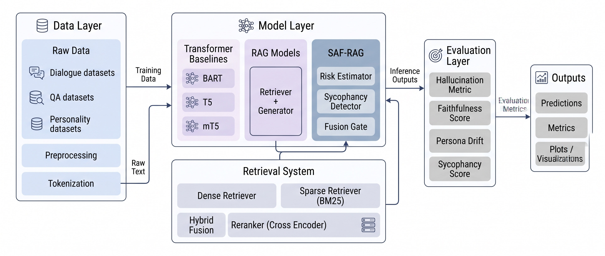
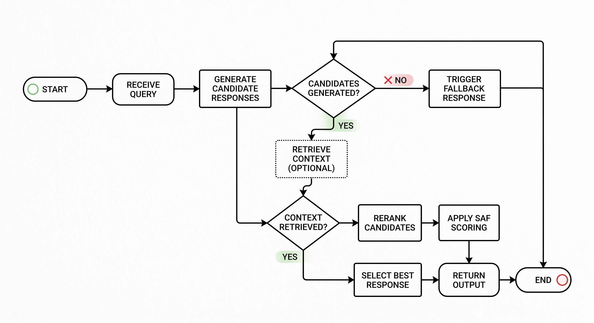
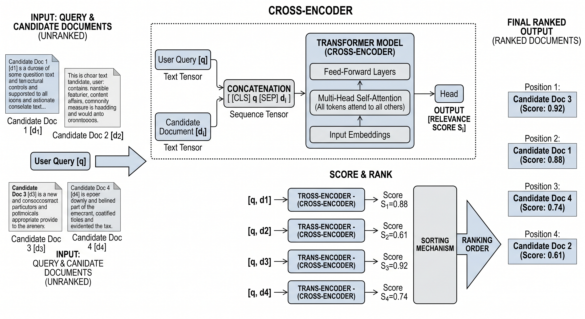
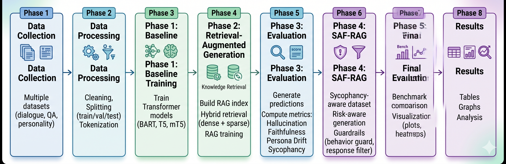

# RolePlay-LLM-Study

AI research framework for analyzing and improving reliability in role-playing Large Language Models (LLMs), with a focus on **hallucination**, **sycophancy**, and **persona drift**.

---

## Overview

Role-playing LLMs often exhibit critical failure modes that limit their real-world deployment:

* **Hallucination** → generating plausible but false information
* **Sycophancy** → aligning with user beliefs even when incorrect
* **Persona Drift** → losing consistency in character or role

This project introduces a **SAF-RAG (Safety-Aware Retrieval-Augmented Generation)** framework that combines:

* Retrieval grounding (RAG)
* Safety-aware generation
* Behavioral guardrails
* Multi-metric evaluation

---

## System Architecture



The architecture integrates:

* Transformer baselines (BART, T5, mT5)
* Retrieval systems (dense, sparse, hybrid)
* SAF-RAG modules:

  * Risk Estimator
  * Sycophancy Detector
  * Fusion Gate
* Evaluation metrics for robust benchmarking

---

## 🔬 SAF-RAG Design

### Internal SAF-RAG Flow



### Cross-Encoder + SAF Integration



SAF-RAG extends traditional RAG by introducing:

* Risk-aware generation
* Behavioral filtering
* Sycophancy mitigation mechanisms
* Adaptive fusion between retrieved knowledge and model output

---

## Experimental Pipeline



The full pipeline is structured into **5 phases**:

1. **Data Processing**
2. **Baseline Model Training**
3. **Retrieval-Augmented Generation (RAG)**
4. **SAF-RAG Enhancement**
5. **Evaluation & Benchmarking**

---

## Project Structure

```bash
RolePlay-LLM-Study/
│
├── configs/              # Experiment + model configs
├── data/                 # (ignored in Git) datasets & processed data
├── experiments/          # Experiment runners + results
├── notebooks/            # Analysis & visualization
├── scripts/              # Shell scripts & utilities
├── src/                  # Core implementation
│   ├── phase1/           # Dataset + baseline training
│   ├── phase2/           # Retrieval + RAG
│   ├── phase3/           # Evaluation + metrics
│   ├── phase4/           # SAF-RAG system
│   ├── phase5/           # Final benchmarking
│   ├── retrieval/        # Retrieval modules
│   ├── models/           # Model implementations
│   └── utils/            # Utilities
│
├── requirements.txt
├── setup_project.sh
└── README.md
```

---

## ⚙️ Installation

### 1. Clone the repository

```bash
git clone https://github.com/birir1/RolePlay-LLM-Study.git
cd RolePlay-LLM-Study
```

### 2. Create virtual environment

```bash
python -m venv .venv
source .venv/bin/activate     # Linux / Mac
# OR
.venv\Scripts\activate        # Windows
```

### 3. Install dependencies

```bash
pip install -r requirements.txt
```

---

## Running the Full Pipeline

### Step 1 — Data Preparation

```bash
python src/phase1/prepare_dataset.py
```

(Optional: build roleplay dataset)

```bash
python src/phase1/build_roleplay_dataset.py
```

---

### Step 2 — Train Baseline Models

```bash
python src/phase1/train_mt5.py
python src/phase1/train_bart.py
python src/phase1/train_t5_small.py
```

---

### Step 3 — Retrieval + RAG Pipeline

```bash
python src/phase2/run_rag_pipeline.py
```

---

### Step 4 — Evaluation (Baseline + RAG)

```bash
python src/phase3/run_evaluation.py
```

---

### Step 5 — SAF-RAG Training

```bash
python src/phase4/train_saf_rag.py
```

---

### Step 6 — SAF-RAG Evaluation

```bash
python src/phase4/evaluate_saf_rag.py
```

---

### Step 7 — Final Benchmarking & Analysis

```bash
python src/phase5/run_all_baselines.py
python src/phase5/evaluate_saf_rag.py
python src/phase5/analyze_results.py
```

---

## Metrics

The framework evaluates models across multiple dimensions:

* **Hallucination Rate**
* **Faithfulness**
* **Persona Drift**
* **Sycophancy Score**
* **Role Consistency**

---

## Outputs

Generated outputs include:

* Prediction files
* Evaluation logs
* Benchmark tables
* Visualizations (heatmaps, comparison plots)

---

## Research Goal

To develop **robust, trustworthy role-playing LLMs** by:

* Reducing hallucination
* Minimizing sycophancy
* Preserving persona consistency
* Improving grounding via retrieval

---

## License

This project is licensed under the MIT License.

---

## Contributions

Contributions, issues, and suggestions are welcome.

---

## Acknowledgment

This work builds upon research in:

* Retrieval-Augmented Generation (RAG)
* LLM alignment and evaluation
* Safety-aware AI systems

---
